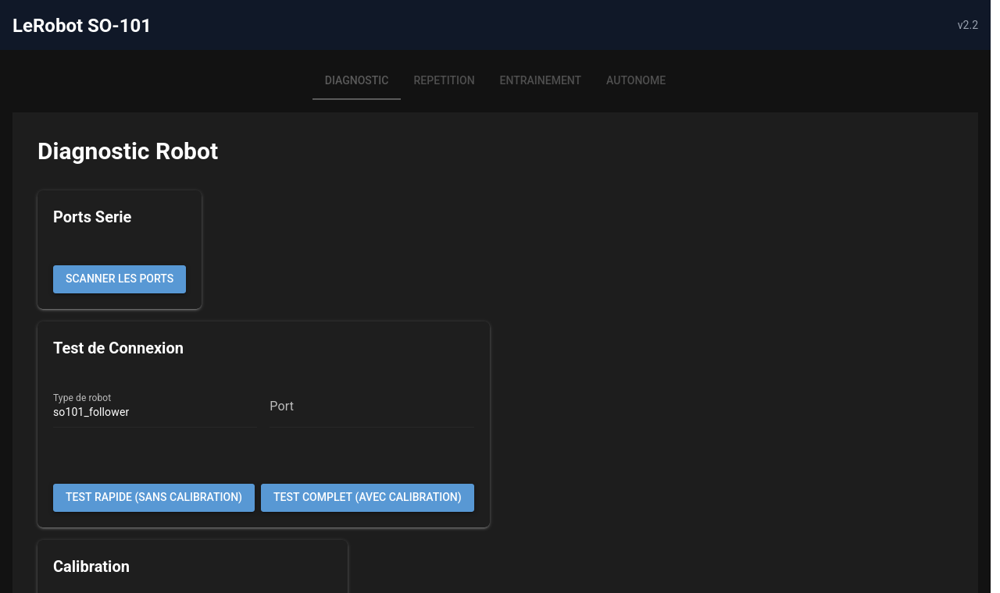
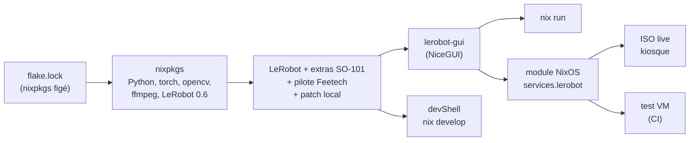

# lerobot-nix-laboratory

[](https://github.com/bdv89/lerobot-nix-laboratory/actions/workflows/ci.yml)


**Un bras robot [LeRobot SO-101](https://github.com/huggingface/lerobot) qui marche pareil sur n'importe quelle machine, grâce à Nix.**

Une commande suffit pour obtenir exactement le même environnement que celui qui a servi à téléopérer le bras, enregistrer des démonstrations et entraîner une politique ACT : mêmes versions de Python, PyTorch, OpenCV, LeRobot et du pilote Feetech. Ce sont les mêmes versions **au bit près**, pas « à peu près ».

```bash
nix run github:bdv89/lerobot-nix-laboratory      # la GUI s'ouvre sur http://localhost:8080
nix develop github:bdv89/lerobot-nix-laboratory  # un shell avec lerobot-record, lerobot-train, lerobot-rollout…
nix build github:bdv89/lerobot-nix-laboratory#iso  # une clé USB qui démarre directement sur la GUI
```

Pré-requis : [Nix](https://nixos.org/download/) avec les flakes activés, sur Linux x86_64. NixOS n'est nécessaire que pour le module système.



## Pourquoi Nix ?

La recette classique (`pip install lerobot`, ou un `requirements.txt`) ne fige que les paquets Python, et encore, approximativement. Les bibliothèques C dont dépendent torch, opencv ou ffmpeg viennent de la distribution de chacun. Résultat : « chez moi ça marche ».

Ici, **`flake.lock` fige la révision exacte de nixpkgs**, donc toute la chaîne : compilateur, glibc, CUDA ou pas, ffmpeg, Python, torch, LeRobot. Chaque paquet est identifié par le hash de ses entrées.

- **Reproductible** : deux machines qui construisent ce flake obtiennent les mêmes chemins `/nix/store/<hash>-…`. Pour le vérifier : `nix path-info .#lerobot-gui`.
- **100 % open source et auditable** : chaque dépendance a une recette lisible dans nixpkgs. Le seul paquet ajouté ici, le SDK Feetech, tient en 30 lignes ([pkgs/feetech-servo-sdk.nix](pkgs/feetech-servo-sdk.nix)).
- **Rien dans le système** : pas de venv qui casse, pas de `LD_LIBRARY_PATH` bricolé, pas de `sudo pip`. Un `nix-collect-garbage` ne peut rien casser.
- **Modifications locales versionnées** : le petit patch apporté à LeRobot ([pkgs/lerobot-control-file.patch](pkgs/lerobot-control-file.patch)) est appliqué de façon déclarative, pas à la main dans un clone.
- **Le système aussi est déclaratif** : udev, groupes et service sont décrits dans un module NixOS, pas dans un tutoriel de 15 étapes.

## Architecture



## Vérifié, pas promis

```bash
nix flake check   # imports Python, tests unitaires de la GUI, et une VM NixOS complète
```

Le test [tests/vm.nix](tests/vm.nix) démarre une vraie machine NixOS avec le module activé. Il vérifie que le service démarre, que la GUI répond et que les permissions sont en place. La CI GitHub le relance à chaque push.

Pour vérifier la reproductibilité vous-même : `nix build .#lerobot-gui --rebuild` reconstruit le paquet et **échoue si le résultat diffère au moindre bit**.

Exemple concret (7 octobre 2026, commit `393a2b6`) : le runner GitHub Actions et un portable NixOS ont construit la GUI indépendamment et obtenu **le même chemin**, `/nix/store/yxcg2r11vcv6krf2nzqkfqm5cniynhnp-lerobot-gui-2.2.0`. Sur le portable, `--rebuild` a ensuite redonné un résultat identique au bit près.

```bash
nix build github:bdv89/lerobot-nix-laboratory/393a2b6#lerobot-gui --print-out-paths
```

## État du projet

| Élément | État |
|---|---|
| Build de LeRobot, du pilote Feetech et de la GUI | ✅ CI |
| Même résultat sur GitHub Actions et en local ; `--rebuild` identique au bit près | ✅ vérifié |
| Tests unitaires de la GUI, test VM NixOS (service, page, permissions) | ✅ CI |
| ISO live : démarrage jusqu'à la GUI en kiosque | ✅ vérifié en VM (QEMU) |
| Checkpoint ACT entraîné en LeRobot 0.4.1, inférence en 0.6.0 | ✅ vérifié en local (CPU) |
| Bras SO-101 réels : téléopération, enregistrement, entraînement | ⏳ utilisés avec l'ancien environnement pip (dataset de 10 épisodes, politique ACT entraînée) ; à revalider avec ce flake |

## Contenu

| Chemin | Rôle |
|---|---|
| `flake.nix` / `flake.lock` | Point d'entrée ; nixpkgs figé |
| `pkgs/feetech-servo-sdk.nix` | Pilote des servos STS3215 (absent de nixpkgs) |
| `pkgs/lerobot.nix` | LeRobot de nixpkgs + extras SO-101 (feetech, hardware, dataset, training, viz) |
| `pkgs/lerobot-gui.nix` + `lerobot-gui/` | Interface web NiceGUI : diagnostic, téléopération, enregistrement, entraînement, exécution autonome |
| `modules/lerobot.nix` | Module NixOS `services.lerobot` |
| `hosts/live-iso.nix` | Image live : démarre en kiosque sur la GUI |
| `tests/vm.nix` | Test d'intégration en VM NixOS |
| `scripts/` | Scripts CLI : `diagnostic`, `teleoperate`, `record`, `replay`, `train`, `run_policy`, `visualize`, `find_cameras` |
| `urdf/SO101/` | Modèle URDF du bras, repris de [TheRobotStudio/SO-ARM100](https://github.com/TheRobotStudio/SO-ARM100) (Apache-2.0) |
| `shell.nix` | Compatibilité `nix-shell` : renvoie vers le même environnement que `nix develop` |
| `lerobot-gui/` (docs) | [README](lerobot-gui/README.md), [QUICKSTART](lerobot-gui/QUICKSTART.md), [CONNECT_ROBOTS](lerobot-gui/CONNECT_ROBOTS.md), [TROUBLESHOOTING](lerobot-gui/TROUBLESHOOTING.md), [CHANGELOG](lerobot-gui/CHANGELOG.md) |

## Sur NixOS : le module

```nix
# flake.nix de votre système
inputs.lerobot.url = "github:bdv89/lerobot-nix-laboratory";

# configuration
imports = [ inputs.lerobot.nixosModules.default ];
services.lerobot = {
  enable = true;
  user = "alice";
  followerPort = "/dev/serial/by-id/usb-1a86_USB_Single_Serial_XXXXXXXXXX-if00";
  leaderPort   = "/dev/serial/by-id/usb-1a86_USB_Single_Serial_YYYYYYYYYY-if00";
  camera.usbId = "05a3:9230";   # → /dev/lerobot_cam
  gui.autostart = true;         # la GUI tourne en service au démarrage
};
```

Ce que fait le module :
- donne au groupe `dialout` l'accès aux cartes CH340 des bras ;
- désactive l'autosuspend USB des bras et de la caméra (sinon le bus décroche en pleine trajectoire) ;
- crée un lien stable `/dev/lerobot_cam` ;
- ajoute l'utilisateur aux groupes `dialout` et `video` ;
- fournit un service systemd optionnel pour la GUI.

> **Astuce** : utiliser les alias `/dev/serial/by-id/…` et jamais `/dev/ttyACM0/1`, dont l'ordre s'inverse au rebranchement. Si le follower reçoit les consignes destinées au leader, c'est le leader qui se tord. Pour trouver les identifiants : `nix develop -c lerobot-find-port`.

## Clé USB live

```bash
nix build .#iso
sudo dd if=result/iso/lerobot-so101-live*.iso of=/dev/sdX bs=4M status=progress
```

On démarre sur la clé : NixOS se lance, la GUI démarre et un Firefox plein écran l'affiche. Aucune installation, aucun réseau nécessaire. Le système live est en RAM : **la calibration et les datasets disparaissent à l'extinction** (copiez `~/.cache/huggingface/lerobot` sur un support persistant).

Test sans matériel : `qemu-system-x86_64 -enable-kvm -m 6G -cdrom result/iso/*.iso`.

## Flux de travail SO-101

Avec les scripts du dépôt (ports et caméra lus depuis `LEROBOT_FOLLOWER_PORT`, `LEROBOT_LEADER_PORT`, `LEROBOT_CAMERA`, `HF_USER`) :

```bash
nix develop -c ./scripts/diagnostic.sh
nix develop -c ./scripts/record.sh mon-dataset "Grab the cube" 10
nix develop -c ./scripts/train.sh mon-dataset act 50000
nix develop -c ./scripts/run_policy.sh outputs/mon-dataset-act/checkpoints/last 30
```

Ou directement avec les commandes LeRobot :

```bash
nix develop
lerobot-find-port
lerobot-calibrate   --robot.type=so101_follower --robot.port=$LEROBOT_FOLLOWER_PORT
lerobot-teleoperate --robot.type=so101_follower --robot.port=$LEROBOT_FOLLOWER_PORT \
                    --teleop.type=so101_leader  --teleop.port=$LEROBOT_LEADER_PORT
lerobot-record  …   # démonstrations
lerobot-train   --dataset.repo_id=<user>/<dataset> --policy.type=act --policy.push_to_hub=false
lerobot-rollout --strategy.type=base --policy.path=outputs/train/…/pretrained_model \
                --robot.type=so101_follower --robot.port=$LEROBOT_FOLLOWER_PORT --duration=30
```

## Limites

- **x86_64-linux uniquement** pour l'instant.
- **CPU par défaut** : la machine de développement a un GPU Intel. Pour CUDA, importer nixpkgs avec `config = { allowUnfree = true; cudaSupport = true; }` ; torch est alors recompilé (plusieurs heures) sauf si un cache binaire CUDA est configuré.
- **LeRobot 0.6.0** (celui de nixpkgs). Un checkpoint ACT entraîné en 0.4.1 se charge et infère correctement en 0.6.0 (vérifié).
- **`scripts/move_ee.py`** (déplacement cartésien de la pince) dépend de `placo`, pas encore empaqueté dans nixpkgs : il ne tourne pas tel quel dans le flake.

## Licence

Apache-2.0, comme LeRobot.
